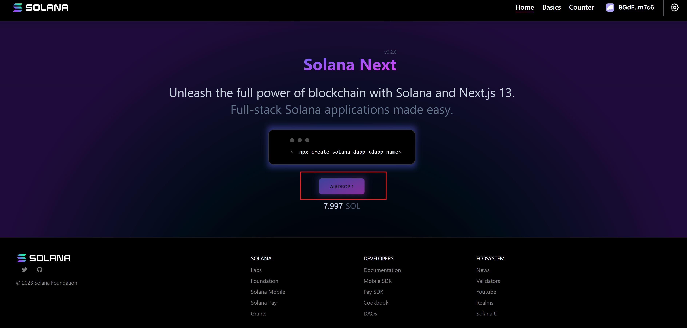
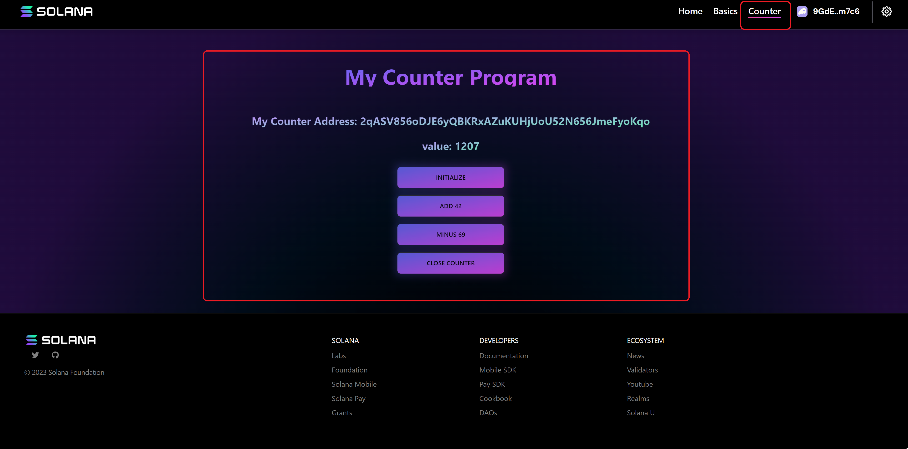
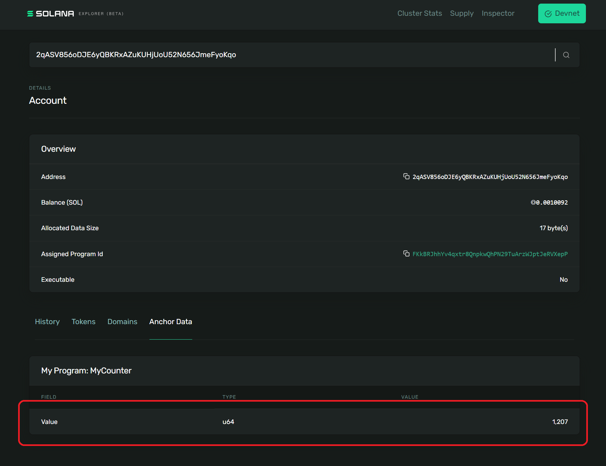

# Basic Solana Developing Process with Anchor Framework (v0.29.0)

This repo is refernce by https://github.com/emersonliuuu/counter-program

Full tutorial:
https://emersonliuuu.notion.site/Basic-Solana-Developing-Process-with-Anchor-Framework-v0-29-0-527e8d64db4c4b4e8449e76e12e437a1?pvs=4

Run the following commands to start the project:

```bash
git clone https://github.com/ak8893893/counter-program.git

cd counter-program
git submodule update --init

anchor keys list
```

Replace the key with your own key in

1. program/src/lib.rs `declare_id!("------Your key here------");`
2. Anchor.toml
   `[programs.localnet]
my_program = "------Your key here------"`

Then run the following commands:

```bash
anchor test
```

NOTICE:
`anchor test` will build, deploy and run the all tests under `tests` folder. You can change the cluster in `Anchor.toml` to test on different clusters, e.g. `localnet`, `devnet`, `testnet`.

Start the frontend

```bash
cd app
yarn
yarn dev
# open localhost:3000  (http://localhost:3000/)
```

Use the frontend to test your Counter Program

1. Connect your wallet (suggest using Phantom wallet).
2. Change the wallet's network to the Devnet.
3. Claim the airdrop if you don't have the testing sol in you wallet.

4. Click Counter to switch the page of counter Program.

5. Initialize an account.
6. Add an even number into the account's value.
7. Minus an odd number into the account's value.
8. You can check you account's value on the front end or solscan with you Counter Address. For example: https://explorer.solana.com/address/2qASV856oDJE6yQBKRxAZuKUHjUoU52N656JmeFyoKqo/anchor-account?cluster=devnet
